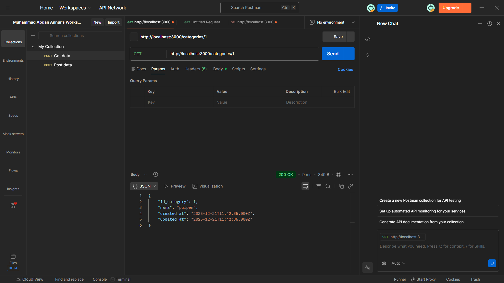
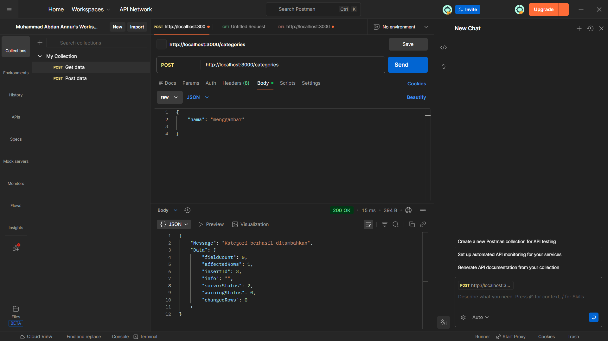
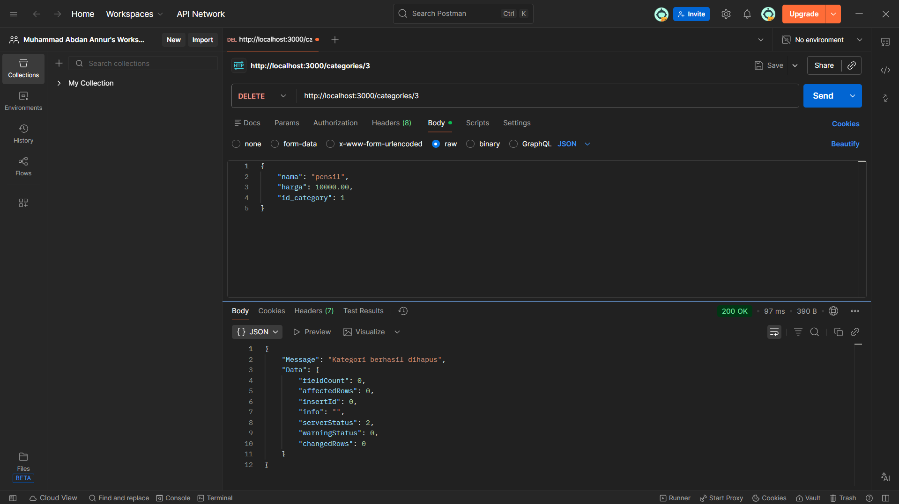
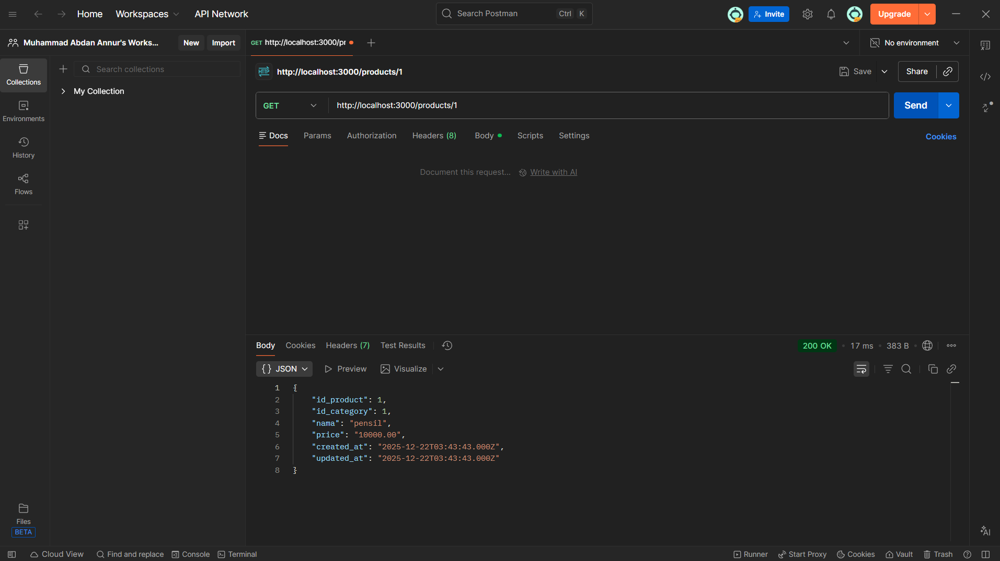

<H1>CARA MENJALANKAN</H1>
1. Nyalakan XAMPP 
2. Download atau clone project ini lalu   
3. Buat database html dan import sql yang tersedia  
4. Jalankan project dengan membuka terminal cmd di VScode "npm run p" 

<H1>---Categories---</H1>
<H3>Lihat data categories</H3>

<H3>Lihat data berdasarkan id categories</H3>

<H3>Tambah data categories</H3>

<H3>Update data categories</H3>

<H3>Hapus data categories</H3>

<H1>---Products---</H1>
<H3>Lihat data products</H3>

<H3>Lihat data berdasarkan id products</H3>

<H3>Tambah data products</H3>

<H3>Update data products</H3>

<H3>Hapus data products</H3>

